# 📖 Documentation Index & Getting Started

**Welcome to Businesstalk24 Platform UI!** Choose your starting point below.

---

## 🚀 Start Here (Choose One)

### ⏱️ **5-Minute Quick Start**
> Just want to get it running?
- **File**: [`QUICK_START.md`](./QUICK_START.md)
- **Time**: 5 minutes
- **Includes**: Installation, environment setup, test routes, common issues
- **Best for**: Immediate development start

### 📝 **Complete Project Overview**
> Want to see what was created?
- **File**: [`PROJECT_SUMMARY.md`](./PROJECT_SUMMARY.md)
- **Time**: 15 minutes read
- **Includes**: All 50+ files, 28 pages, features, tech stack, statistics
- **Best for**: Understanding scope and completeness

### 📁 **File Reference Guide**
> Need to find a specific file?
- **File**: [`FILE_MANIFEST.md`](./FILE_MANIFEST.md)
- **Time**: On-demand lookup
- **Includes**: All files organized by category, navigation guide, quick lookup
- **Best for**: Finding components, pages, utilities

### ✅ **Development Checklist**
> Track your development progress?
- **File**: [`DEVELOPMENT_CHECKLIST.md`](./DEVELOPMENT_CHECKLIST.md)
- **Time**: Ongoing reference
- **Includes**: 8 development phases, backend integration, deployment steps
- **Best for**: Tracking progress and planning next steps

---

## 📚 Complete Documentation

### Core Documentation (Included in Project)

| Document | Purpose | Read Time |
|----------|---------|-----------|
| **README.md** | Comprehensive project documentation, architecture, setup | 20 min |
| **DEPLOYMENT.md** | Step-by-step deployment guides for all platforms | 15 min |
| **CONTRIBUTING.md** | Code style, naming conventions, contribution process | 10 min |

### Quick Reference Guides (New)

| Document | Purpose | Read Time |
|----------|---------|-----------|
| **QUICK_START.md** | 5-minute express setup guide | 5 min |
| **PROJECT_SUMMARY.md** | Executive summary of all features | 15 min |
| **FILE_MANIFEST.md** | Complete file reference and navigation | 10 min |
| **DEVELOPMENT_CHECKLIST.md** | Phase-by-phase development checklist | 30 min |

---

## 🎯 Documentation by Task

### "I just downloaded the project"
1. Start with: [`QUICK_START.md`](./QUICK_START.md)
2. Then: `npm install && npm run dev`
3. Explore: Visit `http://localhost:3000`

### "What exactly was created?"
1. Start with: [`PROJECT_SUMMARY.md`](./PROJECT_SUMMARY.md)
2. Then: [`FILE_MANIFEST.md`](./FILE_MANIFEST.md) for detailed file list
3. Browse: Check `src/` directory structure

### "I need to integrate with backend API"
1. Start with: [`DEVELOPMENT_CHECKLIST.md`](./DEVELOPMENT_CHECKLIST.md) - Phase 2
2. Then: [`README.md`](./README.md) - API Integration section
3. Update: `src/lib/api-client.ts` with your endpoints

### "I need to deploy to production"
1. Start with: [`DEPLOYMENT.md`](./DEPLOYMENT.md)
2. Choose: Your preferred platform
3. Follow: Platform-specific instructions

### "I'm adding new features"
1. Start with: [`FILE_MANIFEST.md`](./FILE_MANIFEST.md) - Quick File Lookup
2. Then: [`README.md`](./README.md) - Architecture section
3. Review: Similar features in codebase for patterns

### "I'm stuck or have questions"
1. Check: [`QUICK_START.md`](./QUICK_START.md) - Common Issues section
2. Review: [`README.md`](./README.md) - Troubleshooting section
3. Browse: [`CONTRIBUTING.md`](./CONTRIBUTING.md) - Code conventions

---

## 📋 Quick Reference Card

### Installation (5 min)
```bash
# 1. Navigate to project
cd e:\GNT_project\business-talk-UI

# 2. Install dependencies
npm install

# 3. Configure environment
Copy-Item .env.example .env.local

# 4. Start development server
npm run dev

# 5. Open in browser
# http://localhost:3000
```

### Key Commands
```bash
npm run dev             # Start development server
npm run build           # Build for production
npm start               # Run production build locally
npm run lint            # Check code quality
docker-compose up       # Run with Docker
```

### Important Files
- **Configuration**: `tailwind.config.ts`, `next.config.js`, `.env.local`
- **API Client**: `src/lib/api-client.ts`
- **State Management**: `src/redux/store.ts`
- **Styles**: `src/app/globals.css`
- **Types**: `src/types/index.ts`

### Route Overview
```
🏠 Landing:     /
🔐 Auth:        /login, /signup, /complete-profile
👤 User:        /dashboard, /profile, /messages, /people, /groups, /blogs, /notifications, /settings
👨‍💼 Admin:      /admin/dashboard, /admin/users, /admin/posts, /admin/moderation, ...
⚖️ Legal:       /privacy-policy, /user-agreement
```

---

## 📊 What's Included

### ✅ Complete & Ready
- 28 fully implemented pages
- 15+ reusable components
- Redux Toolkit state management
- API client with 30+ endpoints
- WebSocket real-time utilities
- Form validation with Zod
- Docker containerization
- Complete documentation

### ⏳ Ready for Integration
- Backend API connections
- Real data from your API
- Google OAuth setup
- Payment integration
- Email notifications
- Advanced analytics

### 🎓 Learning Materials
- Code examples throughout
- TypeScript strict mode
- React best practices
- Redux patterns
- Form handling examples
- Responsive design

---

## 🗺️ Your Development Path

```mermaid
graph LR
    A["1. Setup<br/>5 min"] -->|"npm install + npm run dev"| B["2. Explore<br/>15 min"]
    B -->|"Review pages & components"| C["3. Integrate<br/>1-2 days"]
    C -->|"Connect to backend API"| D["4. Enhance<br/>3-5 days"]
    D -->|"Add features & optimize"| E["5. Deploy<br/>1 day"]
    E -->|"Push to production"| F["✅ Live!"]
    
    style A fill:#e1f5ff
    style B fill:#f3e5f5
    style C fill:#fff3e0
    style D fill:#e8f5e9
    style E fill:#fce4ec
    style F fill:#c8e6c9
```



---

## 🎓 Resources

### Documentation Structure
```
project-root/
├── README.md                    # Main documentation
├── QUICK_START.md              # 5-minute setup
├── PROJECT_SUMMARY.md          # Feature overview
├── FILE_MANIFEST.md            # File reference
├── DEVELOPMENT_CHECKLIST.md    # Phase checklist
├── DEPLOYMENT.md               # Deploy guides
├── CONTRIBUTING.md             # Code guidelines
└── DOCUMENTATION_INDEX.md      # This file
```

### Key Sections in README
- Project Overview
- Tech Stack Explanation
- Project Structure
- Setup Instructions
- Redux Architecture
- API Client Guide
- WebSocket Setup
- Form Validation
- Deployment Guides
- Troubleshooting

### Deployment Guides (DEPLOYMENT.md)
- Vercel (recommended for Next.js)
- AWS Amplify
- AWS EC2
- Google Cloud Platform
- DigitalOcean
- Docker (local & production)
- Security checklist

---

## 💡 Pro Tips

### 1. Start Simple
- Read: `QUICK_START.md` (not README)
- Run: `npm install && npm run dev`
- Don't get overwhelmed by documentation

### 2. Explore by Doing
- Visit all pages in browser
- Try forms and interactions
- Check Redux DevTools
- Inspect network requests

### 3. Use File Reference
- Need a component? Check `FILE_MANIFEST.md`
- Need a page template? Look in `src/app/`
- Need API methods? See `src/lib/api-client.ts`

### 4. Follow the Checklist
- Use `DEVELOPMENT_CHECKLIST.md` to track progress
- Clear goals for each phase
- Know what's next

### 5. Keep Documentation Handy
- Use Ctrl+F to search docs
- Bookmark key files
- Refer back often

---

## ❓ FAQ

### Q: How long does setup take?
**A:** ~5 minutes for `npm install` + `npm run dev`. See [`QUICK_START.md`](./QUICK_START.md).

### Q: What needs backend integration?
**A:** Authentication, posts, messages, profile data. See [`DEVELOPMENT_CHECKLIST.md`](./DEVELOPMENT_CHECKLIST.md) Phase 2.

### Q: How do I add a new page?
**A:** Check [`README.md`](./README.md) Architecture section, then use similar page as template.

### Q: Where do I configure Tailwind colors?
**A:** Edit `tailwind.config.ts` and `src/app/globals.css`.

### Q: How do I deploy to production?
**A:** Read [`DEPLOYMENT.md`](./DEPLOYMENT.md), choose your platform, follow steps.

### Q: Is everything production-ready?
**A:** Yes! All code is production-quality. Just needs backend API and real data.

### Q: Can I modify the design?
**A:** Yes! See `tailwind.config.ts`, `src/app/globals.css`, and component files.

### Q: How do I test features?
**A:** See test routes in [`QUICK_START.md`](./QUICK_START.md) - no login needed for auth pages.

---

## 🎯 Next Steps (Right Now!)

### 👉 **IMMEDIATE ACTION** (Do This First)

1. **Open Terminal**
   ```powershell
   cd e:\GNT_project\business-talk-UI
   ```

2. **Read Quick Start**
   ```powershell
   # Open in your editor or read online
   QUICK_START.md
   ```

3. **Install & Run**
   ```powershell
   npm install
   npm run dev
   ```

4. **Open Browser**
   - Visit: http://localhost:3000
   - Explore pages
   - Try forms

5. **Next: Backend Integration**
   - Open `DEVELOPMENT_CHECKLIST.md`
   - Follow Phase 2
   - Connect to your API

---

## 📞 Support

### If You're...

- **🤷 Confused about what to do next**
  - Read: [`QUICK_START.md`](./QUICK_START.md)
  - Then: [`DEVELOPMENT_CHECKLIST.md`](./DEVELOPMENT_CHECKLIST.md)

- **🔍 Looking for a specific file**
  - Check: [`FILE_MANIFEST.md`](./FILE_MANIFEST.md)

- **🏗️ Building a new feature**
  - Read: [`README.md`](./README.md) Architecture section
  - Browse: Similar features in code

- **🚀 Ready to deploy**
  - Follow: [`DEPLOYMENT.md`](./DEPLOYMENT.md)

- **🔧 Encountering an issue**
  - Check: [`QUICK_START.md`](./QUICK_START.md) Common Issues
  - Read: [`README.md`](./README.md) Troubleshooting

- **📝 Contributing code**
  - Follow: [`CONTRIBUTING.md`](./CONTRIBUTING.md)

---

## ✨ You're All Set!

Everything is ready. Just run `npm install && npm run dev` and start building!

**Choose your starting point above** ☝️

---

**Questions? Check the relevant guide or file reference above!** 📚

Last Updated: 2024
